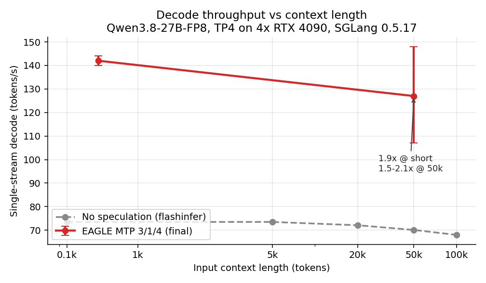
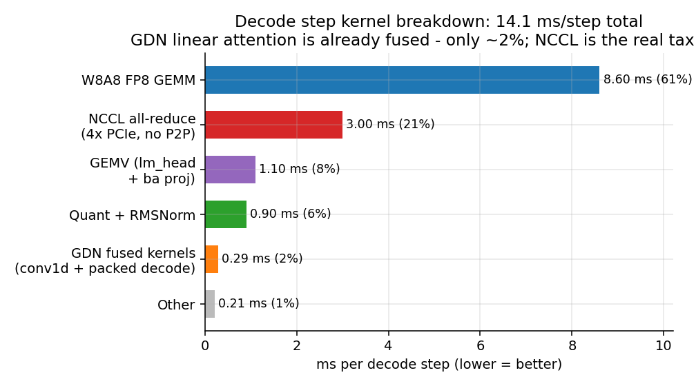
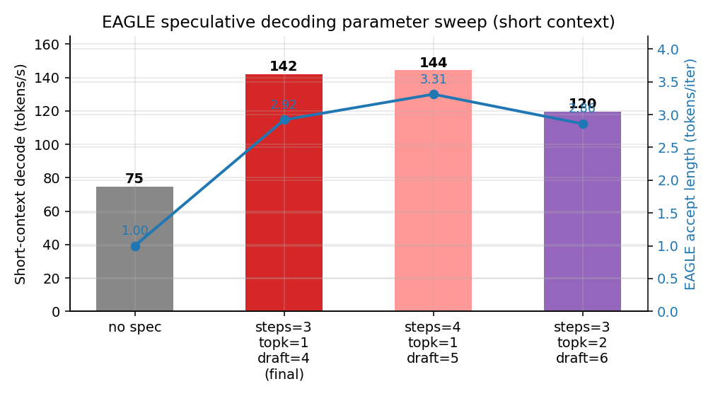
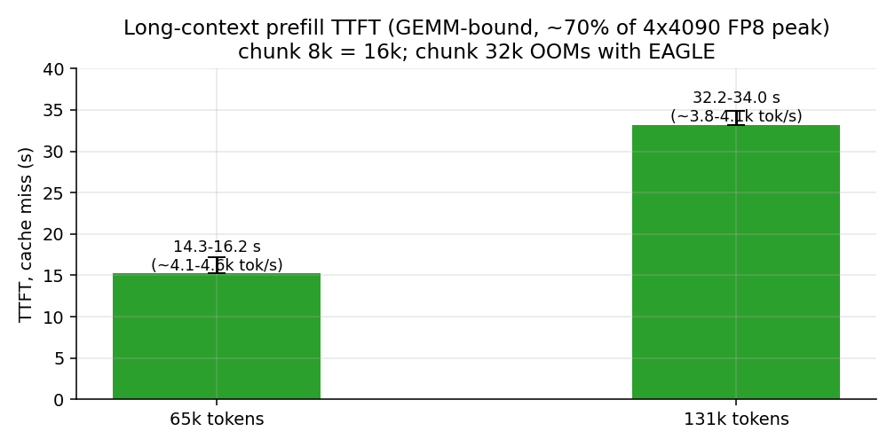
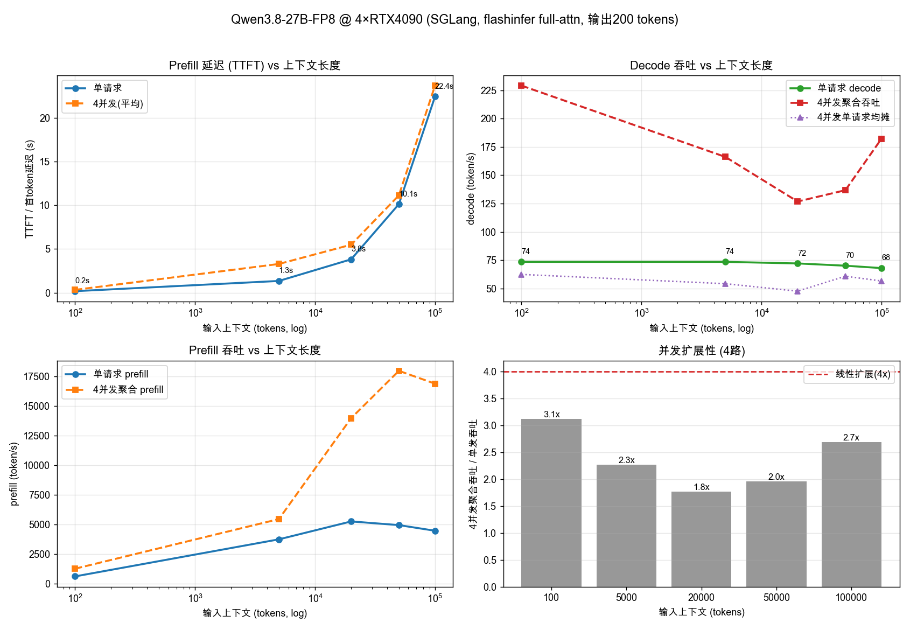

# Qwen3.8-27B × 4×RTX 4090 SGLang 调优全记录

> **TL;DR**：Qwen3.8-27B-FP8（48 层 GDN 线性注意力 + 16 层全注意力的混合架构，原生 256K）在 4×RTX 4090（24GB，无 P2P）上用 SGLang 0.5.17 部署调优。通过修复 EAGLE/MTP 投机解码的两个真实 OOM 并证伪"长上下文崩溃"，单流 decode 从 **74.85 → ~142 tps（+90%）**，50k 长上下文 decode **107–148 tps**（不再降速），prefill 稳态 ~4–4.6k tok/s。

**English abstract**: Deployment & tuning notes for serving Qwen3.8-27B-FP8 (hybrid Gated-DeltaNet linear attention + full attention, 256K context) with SGLang on 4× RTX 4090 (TP4, no P2P). We show that the widely-believed "EAGLE/MTP collapses on long context for hybrid linear-attention models" was actually a **benchmarking artifact plus two fixable OOMs** — with `--mem-fraction-static 0.80` + `--disable-prefill-cuda-graph`, EAGLE delivers ~142 tps short-context and 107–148 tps at 50k context (vs 74.85/74.84 without speculation). We also show GDN decode is already fully fused (~2% of step time — don't rewrite it), NCCL all-reduce is the structural tax (21%, no P2P on GeForce), and prefill is GEMM-bound (~70% of FP8 peak). Full record (Chinese): [docs/tuning-record.md](docs/tuning-record.md).

---

## 结果一览

| 指标 | 无投机（旧基线） | EAGLE 3/1/4（最终） | 变化 |
|---|---|---|---|
| 短上下文 decode | 74.85 tps | **~142 tps** | **1.9×** |
| 50k decode | 74.84 tps | **107–148 tps** | 1.4–2.0× |
| 100k+（133k tokens） | 68.0 tps | 正常，无衰减崩溃 | needle ✓ |
| accept length | — | 2.9–3.3 | — |
| 50k TTFT（cache miss） | ~10–16 s | 14.3–16.4 s | 持平（GEMM bound） |
| 4 并发聚合 decode | 229 tps | 233–256 tps | 略升 |
| 质量集 / needle / 多模态 | — | 全部通过 | 无损 |



## 三个关键结论

### 1. "MTP 长上下文崩溃"是统计假象 + 可修复的 OOM

旧测量显示 EAGLE 在 50k 长上下文降到 12.8 tps，被归因为"GDN 状态重放 O(序列长度)"。本轮复查发现真相是：

- **统计假象（主因）**：SGLang 的 `Decode batch` 日志行 `gen throughput` = 距上一行日志的 token/墙钟时间。长 prefill 结束后的**第一行** decode 日志把整个 prefill 时间计入分母（50k prefill ≈ 15 s → 显示 6–13 tps）。压测输出若太短（日志间隔 40 迭代内结束）就只会采到这一行假象。**修正：丢弃每个请求 prefill 后的首行日志，或用客户端 (wall − TTFT) 计算 decode tps。**
- **真实 OOM（已修）**：EAGLE 在 `mem-fraction ≥0.85` 下有两个 OOM 点——启动期 draft-extend CUDA graph 捕获 logits all-gather buffer（248k 词表放大显存）；运行期长 prefill 每 chunk 后的 draft-extend 瞬时激活超限。修复组合：`--mem-fraction-static 0.80` + `--disable-prefill-cuda-graph`（prefill 图是显存大头，且 prefill 本身 GEMM bound，禁图无损 TTFT）。
- 源码核实：verify 后 mamba 状态提交走融合 gather-scatter（O(1) 定长），无 O(序列长度) 重放；50k spec decode profile 显示全注意力 verify 仅 ~1.8 ms/迭代，无病态热点。

### 2. GDN 不需要重写 kernel——它早已融合，只占 2%

SGLang 0.5.17 的 GDN decode 链路已是 `fused_recurrent_gated_delta_rule_packed_decode`（L2norm + softplus gating + delta rule 单 kernel）。torch profiler 实测 decode 每步 14.1 ms：GDN 三件套（packed_decode 3µs + conv1d 1.8µs + gated norm）合计 **0.29 ms ≈ 2%**。真正的瓶颈是 W8A8 FP8 GEMM（61%，已近显存带宽极限）和 NCCL all-reduce（21%）。



### 3. NCCL 是无 P2P 消费卡的结构性税，驱动层无解

逐项实测排除：

- PCIe 链路负载下 **Gen4 x16 满速**（空闲显示 2.5 GT/s 是省电降速假象）；
- 锁频 `-lgc 3105 -lmc 10501` 无收益（功耗墙压回 ~2745 MHz）；
- NCCL 已是 RING_LL 低延迟协议；`NCCL_ALGO=TREE` 直接 `invalid usage` 崩溃；
- P2P 是 GeForce 驱动的产品级封锁，无用户态开关；flashinfer/mscclpp/torch-symm-mem 融合 all-reduce 全部因此不可用；
- 唯一出路是带 NVLink 的硬件（H20/A100/H100 级）或接受现状。

## EAGLE 参数扫描与 prefill



- **3 steps / topk=1 / 4 draft 为生产最优**：4 steps 的 accept（3.31）更高但 tps 噪声内打平、每请求多占 mamba 槽位降低并发；topk=2 树草稿在带宽 bound 下净亏（119.5 tps）。
- 其他后端参考：vLLM nightly + MTP 在 SM89 上仅 21–25 tps（draft 前向效率 ~25%），远不及 SGLang EAGLE。



prefill 为 GEMM 算力 bound：~4–4.6k tok/s ≈ 4×4090 FP8 理论峰值的 70%。chunk 8k/16k 无差别，32k 在 EAGLE 下 OOM。

无投机基线的完整并发/变长 benchmark（4 并发、100–100k 上下文）：



## 最终生产配置

```bash
python -m sglang.launch_server \
  --model-path /root/models/Qwen3.8-27B-FP8 \
  --tensor-parallel-size 4 --context-length 262144 \
  --chunked-prefill-size 8192 --max-prefill-tokens 32768 \
  --host 0.0.0.0 --port 8000 \
  --mem-fraction-static 0.80 \
  --disable-prefill-cuda-graph \
  --load-format safetensors --kv-cache-dtype fp8_e4m3 \
  --mm-feature-transport cpu \
  --attention-backend flashinfer \
  --mamba-ssm-dtype bfloat16 \
  --speculative-algorithm EAGLE \
  --speculative-num-steps 3 --speculative-eagle-topk 1 --speculative-num-draft-tokens 4 \
  --reasoning-parser qwen3 --tool-call-parser qwen3_coder \
  --api-key sk-CHANGE-ME --enable-metrics --enable-cache-report
```

**EAGLE 显存红线**：`mem-fraction` 必须 ≤0.80 且关闭 prefill CUDA graph，否则启动期 draft-extend graph 捕获或运行期长 prefill 的 draft-extend OOM。注意 spec 模式每请求占 5 个 mamba 状态槽，`max_running_requests` 受 mamba cache 封顶（本机 ~27；提并发用 `--max-mamba-cache-size`）。

## 复现与工具（scripts/）

| 脚本 | 用途 |
|---|---|
| `run_sglang.sh` | 生产启动脚本（上述配置） |
| `sgl_launch.sh` | 多配置实验启动器（nospec / eagle / eagle-s4 / eagle-t2 / chunk 变体） |
| `sgl_bench3.py` | 统一压测：短 + 50k（needle）+ 8 题质量集；**已修正首行日志假象**，同时输出服务端与客户端 tps |
| `sgl_ttft.py` | prefill TTFT 压测（随机盐绕 radix cache） |
| `sgl_profile_spec50k.py` / `sgl_profile_decode.py` | torch profiler 采集与 kernel 时间聚合 |
| `sgl_final_check.py` | 验收：100k needle + 4 并发 + 多模态冒烟 |
| `quality_diff.py` | 质量集与基线对比门禁 |
| `gen_charts.py` | 本 README 图表生成 |

环境与踩坑（flashinfer JIT 的 cccl 补丁、ninja、`-lcudart` 链接、fastsafetensors 弃用等）见 [docs/tuning-record.md](docs/tuning-record.md) §2。

## 验证方法学（质量不下降的判定）

- 8 题质量集（精确计算/方程/代码/翻译/SQL/推理）关键答案门禁，与无投机基线等价；
- 50k / 100k（实测 133k tokens）needle-in-haystack（884213）通过；
- 多模态识图冒烟通过；
- 注意：temp=0 下同配置多次运行也不逐字一致（批处理/原子数值抖动），判定用关键答案而非全文比对。

## 环境

- GPU：4× RTX 4090 24GB（SM89，QEMU 直通 VM，无 P2P/NVLink）
- 驱动 580.173.02 / CUDA 13.2 / Python 3.12 / SGLang 0.5.17
- 模型：Qwen3.8-27B-FP8（官方 FP8，混合注意力，256K 上下文，内置 MTP 头）

## License

MIT
